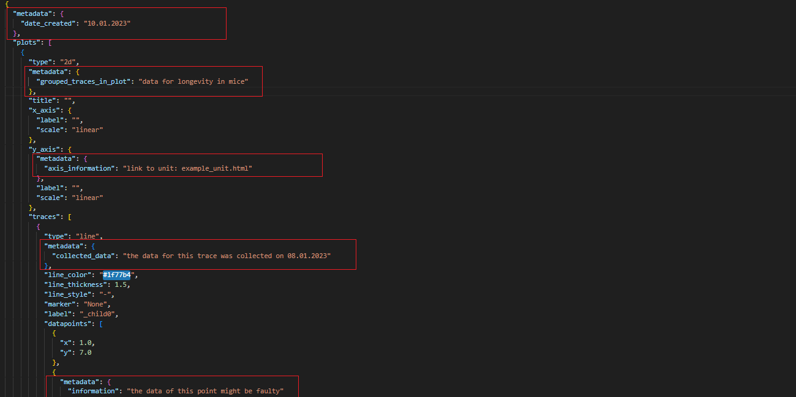

Getting Started
===============

Installation
------------
Install PlotSerializer by running

.. code-block:: bash

    pip install plot-serializer

Serializing your first plot
---------------------------
We will serialize an example matplotlib plot that we have created as follows:

.. code-block:: python

    import numpy as np
    import matplotlib.pyplot as plt

    fig, ax = plt.subplots()

    np.random.seed(19680801)

    X = np.round(np.linspace(0.5, 3.5, 100), 3)
    Y1 = 3 + np.cos(X)
    Y2 = 1 + np.cos(1 + X / 0.75) / 2

    ax.set_xlim(0, 4)
    ax.set_ylim(0, 4)

    ax.tick_params(which="major", width=1.0, length=10, labelsize=14)
    ax.tick_params(which="minor", width=1.0, length=5, labelsize=10, labelcolor="0.25")

    ax.grid(linestyle="--", linewidth=0.5, color=".25", zorder=-10)

    ax.plot(X, Y1, c="C0", lw=2.5, label="Blue signal", zorder=10)
    ax.plot(X, Y2, c="C1", lw=2.5, label="Orange signal")

    ax.set_title("Example figure", fontsize=20, verticalalignment="bottom")
    ax.set_xlabel("TIME in s", fontsize=14)
    ax.set_ylabel("DISTANCE in m", fontsize=14)
    ax.legend(loc="upper right", fontsize=14)

    plt.show()

Of particular interest are the two following lines:

.. code-block:: python

    import matplotlib.pyplot as plt

    fig, ax = plt.subplots()

To collect the data from the plot, we want to serialize, we first need to create a ``Serializer`` object.
Specifically, since we're looking at matplotlib in this case, we need to create a ``MatplotlibSerializer``.
The ``MatplotlibSerializer`` also exposes a ``subplots()``-Method.
This way the ``Serializer`` is able to capture everything you do with the returned objects.

In concrete terms, we replace the two lines above with the following code:

.. code-block:: python

    from plot_serializer.matplotlib.serializer import MatplotlibSerializer

    serializer = MatplotlibSerializer()
    fig, ax = serializer.subplots()

Finally, get the resulting Json string, we can invoke the ``json()``-Method on the serializer:

.. code-block:: python

    serializer.to_json()

We can also write the plot to a file directly:

.. code-block:: python

    serializer.write_json_file("test_plot.json")

Adding custom metadata
----------------------------------------
In case of data that can not be plotted or serialized, PlotSerializer provides the option of adding it to the JSON file regardless.
There are five places inside the JSON's hierachy that metadata can be added:
To the entire figure of plots, individual plots, their axis if existent, their traces, and the traces datapoints/slices/boxes. For an Introduction on the Hierachy see Overview.
Metadata is always added via a dict parameter.
A full example:

.. code-block:: python

    from plot_serializer.matplotlib.serializer import MatplotlibSerializer
    import logging

    # set logging to info to get feedback how many traces/datapoints get selected
    logging.basicConfig(level=logging.INFO)
    serializer = MatplotlibSerializer()
    _, ax = serializer.subplots()

    x = [1, 4]
    y = [7, 4]
    z = [10, 4]
    ax.plot(x, y)
    ax.plot(y, z)

    serializer.add_custom_metadata_figure({'date_created' : "10.01.2023"})
    serializer.add_custom_metadata_plot({'grouped_traces_in_plot' : "data for longevity in mice"})
    serializer.add_custom_metadata_axis({'axis_information' : "link to unit: example_unit.html"}, axis="y")
    serializer.add_custom_metadata_trace({'collected_data' : "the data for this trace was collected on 08.01.2023"}, trace_selector=0)
    serializer.add_custom_metadata_datapoints({'information' : "the data of this point might be faulty"}, trace_selector=0, point_selector= 1)

To understand where each metadata gets added you can take a look at the JSON output:

**Selecting Traces:**
There are two options to select traces: By index and by distance.
Selecting by index is done by passing trace_selector an integer. It selects the trace corresponding to the i-th plot plotted.
Selecting by distance can be done via a tuple and relative tolerance. It selects the traces which have a datapoint near the given point.

.. code-block:: python

    serializer.add_custom_metadata_trace({'collected_data' : "the data for this trace was collected on 08.01.2023"}, trace_selector=0)
    serializer.add_custom_metadata_trace({'collected_data' : "the data for this trace was collected on 17.07.2023"}, trace_selector=(3,3), trace_rel_tolerance=0.0001)

**Selecting Points:**
Selecting points is done similarily to selecting traces. By index or distance. You can however also narrow the traces down via the same rules given in the paragraph above.
Selecting by index is done by passing point selector an integer. It selects the datapoint corresponding to the index of your input data.
Pie Plots slices and Bar plots bars are also considered as points in this specific regard and can be supplemented with metadata.
Selecting by distance is only viable for datapoints where all axes units are numbers, scatter, lines, surface, etc.

.. code-block:: python

    serializer.add_custom_metadata_datapoints({'information1' : "the data of this point might be faulty"}, trace_selector=0, point_selector= 1)
    serializer.add_custom_metadata_datapoints({'information2' : "the data of this point might be faulty"}, trace_selector=(1,1), trace_rel_tolerance=0.2, point_selector= 1)
    serializer.add_custom_metadata_datapoints({'information3' : "the data of this point might be faulty"}, trace_selector=0, point_selector=point_selector= (4,4), point_rel_tolerance= 0.0001)
    serializer.add_custom_metadata_datapoints(
        {'information4' : "the data of this point might be faulty"}, trace_selector=(1,1), trace_rel_tolerance=0.2, point_selector= (4,4), point_rel_tolerance= 0.0001
        )
    #specifying no trace will lead to searching above all traces
    serializer.add_custom_metadata_datapoints({'information5' : "the data of this point might be faulty"}, point_selector= 1)

What does, what does not get serialized?
----------------------------------------

PlotSerializer always reads out the main data for the plot. Further supported parameters will be specifically noted in this documentation, see "Supported Plot Types".
Note that parameters which are used to make the diagram more appealing are not extracted by PlotSerializer. Instead they might distort the data inside the JSON file.
Because of this we recommend to run PlotSerializer first once with your raw data, and simply add the all stylish choices for the plot afterwards.
Similarly beware of modifying the diagram anywhere else besides the creation methods, such as plot,pie,scatter.
An example of this would be you taking the returned objects of these methods and calling further functions on them, modyfying their attributes.
This will not be caught upon by PlotSerializer and the change will be ignored.

Besides the data of the plots, the title label and scales of the axes as well as the title of the whole figure combining them will be serialized.

Integrating with RO-Crates
--------------------------

PlotSerializer is able to integrate with `RO-Crates <https://www.researchobject.org/ro-crate/>`_.
This means that you can add the serialized diagrams to an RO-Crate as a file with appropriate metadata.
You can accomplish this through the ``add_to_ro_crate()``-Method.
The first argument is the file path to the ro-crate directory and the second argument is the location where the file should be placed within the crate.
When the specified RO-Crate does not exist, a new one is created (this can also be controlled through the ``create`` parameter).
PlotSerializer will try to figure out an appropriate name for the object, but can also be explicitly specified with the ``name`` parameter.

.. code-block:: python

    serializer.add_to_ro_crate("crate", "my-plot-2.json")

Deserializing a plot from JSON
------------------------------

PlotSerializer also provides the functionality of converting the JSON file back into a diagram.
Only serialized attributes can influence the deserialized plot,
the created graph might thus look slightly different from the original, the data however will remain unchanged.

We deserialize the JSON file created above as follows:

.. code-block:: python

    from plot_serializer.matplotlib.deserializer import deserialize_from_json_file
    from matplotlib.pyplot as plt

    fig = deserialize_from_json_file("test_plot.json")
    plt.show()

Hint for Jupyter Notebook users: Calling plt.show is unneccessary as the deserialize_from_json_file function returns a figure which gets automatically rendered!
