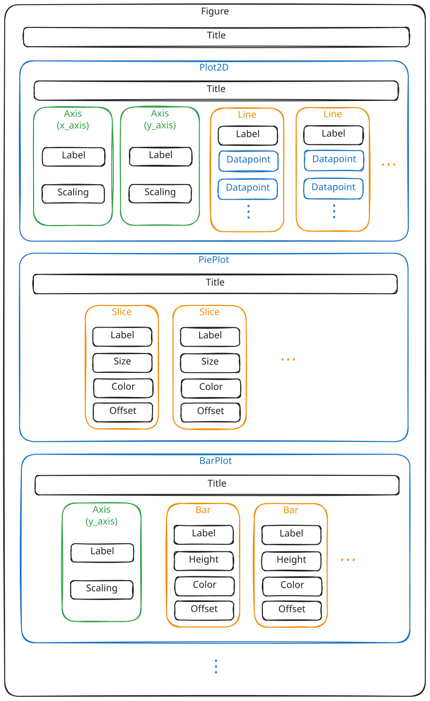
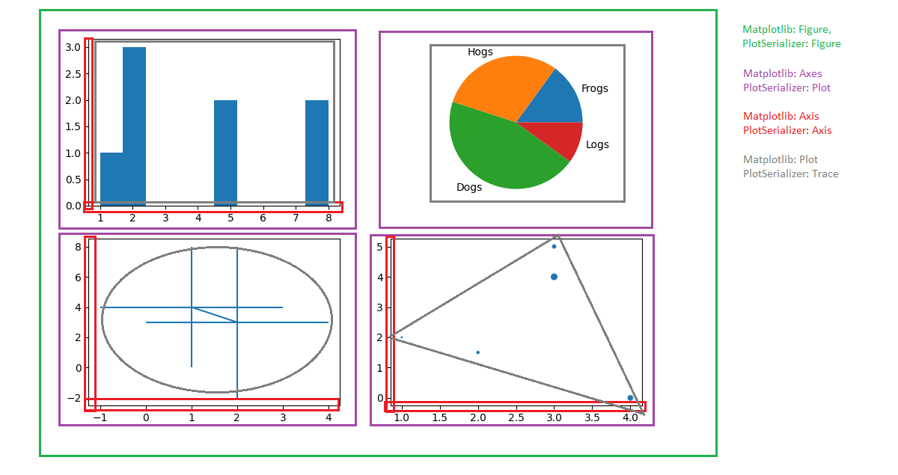

Overview
---------------------------------
PlotSerializer helps researchers and scientists of all kinds to store research data cleanly.
Specifically, the aim is to convert raw data published for graphs within published in scientific publications into a machine-readable format as easily as possible.
In the case of a scientific paper, for example, the data can be published directly together with the paper so that it can be used later by other researchers.
In a broader sense, this also contributes to the prevention of studies that cannot be reproduced, keyword: reproducibility crisis.
Access to the raw data of research enables scientists who want to build on existing work a much deeper insight into the original facts.

Installation
---------------------------------

Install PlotSerializer by running

.. code-block:: bash

    pip install plot-serializer

Getting Started
---------------------------------

We will serialize an example matplotlib plot that we have created as follows:

.. code-block:: python

    import numpy as np
    import matplotlib.pyplot as plt

    fig, ax = plt.subplots()

    x = [1,2,3,4]
    y = [1,4,9,16]

    ax.plot(x, y)

    plt.show()

Of particular interest are the two following lines:

.. code-block:: python

    import matplotlib.pyplot as plt

    fig, ax = plt.subplots()

To collect the data from the plot, we want to serialize, we first need to create a ``Serializer`` object.
Specifically, since we're looking at matplotlib in this case, we need to create a ``MatplotlibSerializer``.
The ``MatplotlibSerializer`` also exposes a ``subplots()``-Method.
This way the ``Serializer`` is able to capture everything you do with the returned objects.

In concrete terms, we replace the two lines above with the following code:

.. code-block:: python

    from plot_serializer.matplotlib.serializer import MatplotlibSerializer

    serializer = MatplotlibSerializer()
    fig, ax = serializer.subplots()

Finally, get the resulting Json string, we can invoke the ``json()``-Method on the serializer:

.. code-block:: python

    serializer.to_json()

We can also write the plot to a file directly:

.. code-block:: python

    serializer.write_json_file("test_plot.json")

How PlotSerializer sees diagrams
---------------------------------

PlotSerializer uses its own data model for representing scientific diagrams.
The base class for this data model is ``plot_serializer.model.Figure``.
A full Json-Schema for this model is available in this documentation as well.

The basics are illustrated by the following diagram:

PlotSerializer's data model was designed as a general representation of scientific diagrams.
The following sections will explain differences of connotations for parts of the diagram for each supported plotting library.

**Matplotlib**

