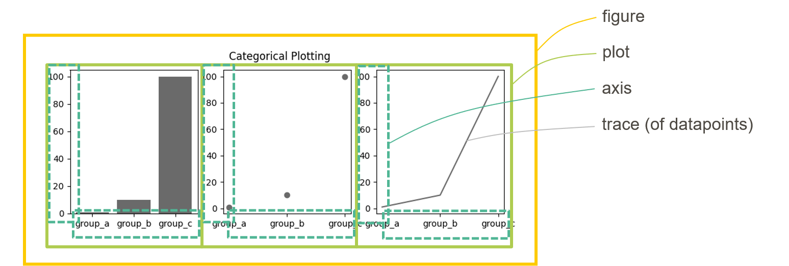

How PloSe sees diagrams
=======================
PloSe uses its own data model for representing scientific diagrams.
The data model was designed as a general representation of scientific diagrams.
The base class for this data model is ``plot_serializer.model.Figure``.
A full JSON schema for this model is available in this documentation as well.

The basic data model of a diagram in PloSe is illustrated below.

.. .. image:: static/data_structure.svg
  :width: 800
  :alt: Plot Serializer data structure
