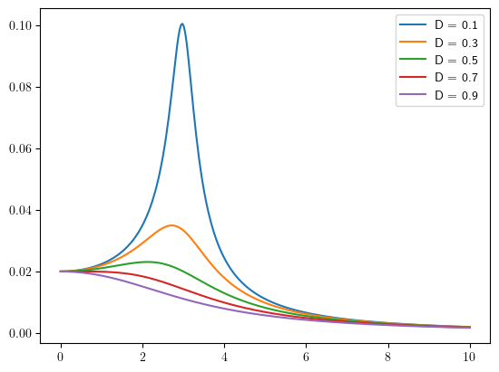
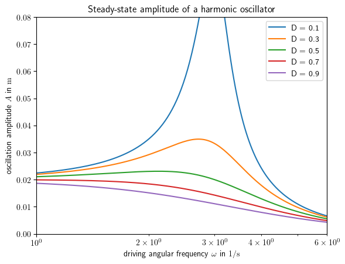
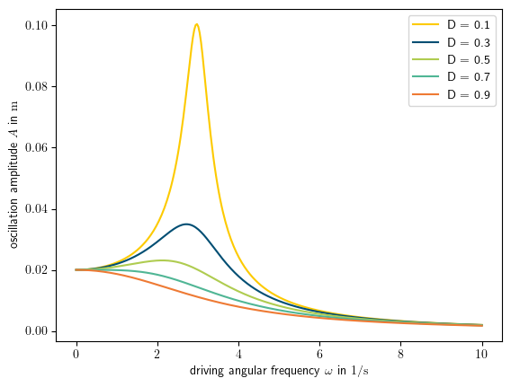

How it works
============
PloSe's aim is to help you create a dataset that perfectly corresponds to your figure.
By wrapping the matplotlib plotting functions, PloSe captures data exactly as you pass them to the plotting function.

PloSe's focus lies on serializing the information content with regard to data rather than visual representation.
The serialized information about visual representation is limited to the minimum required for basic reproducibility (e.g., axis scaling) 
or telling traces and data points apart (e.g., line/point colors, styles and  markers).

Example
-------
Let's plot the amplitude A of a damped harmonic oscillator driven by a periodic force with the amplitude A_E:

.. code-block:: python

    import numpy as np
    from plot_serializer.matplotlib.serializer import MatplotlibSerializer

    n = 300

    A_E = 0.02  # driving force amplitude
    omega_0 = 3  # eigenfrequency of the oscillator
    omega = np.linspace(0, 10, n)  # driving force frequency
    eta = omega/omega_0  # relative driving force frequency 

    def calculate_amplitude(D, eta, A_E):
        A = A_E/np.sqrt((1-eta**2)**2 + (2*eta*D)**2)
        return A

    serializer = MatplotlibSerializer()
    fig, axs = serializer.subplots()

    D_list = np.arange(0.1, 1, 0.2)  # damping ratio

    for D in D_list:
        axs.plot(omega, calculate_amplitude(D, eta, A_E), label="D = {}".format(round(D,2))) 
    
    axs.legend()
    serializer.show()

Adding Serializable Data-Related Information
--------------------------------------------
Any good diagram will contain axis labels, and, optionally, a plot title. We can add these to the example above the same way as if we were using ``matplotlib``:

.. code-block:: python

    plt.rcParams['text.usetex'] = True

    axs.set_xlabel(r'driving angular frequency $\omega$ in $1/\mathrm{s}$')
    axs.set_ylabel(r'oscillation amplitude $A$ in $\mathrm{m}$')

    axs.set_title("Steady-state amplitude of a harmonic oscillator")

    serializer.show()

You may want to limit the axis range:

.. code-block:: python

    axs.set_xlim(1, 6)
    axs.set_ylim(0, 0.08)

You may want to change axis scaling e.g. to a logarithmic scale:

.. code-block:: python

    axs.set_xscale("log")

This is what the diagram will now look like:

Let's export to JSON:

.. code-block:: python

    serializer.write_json_file("test_json.json")

... and inspect how the information is represented in the JSOn file:

.. code-block:: json
    :force:

    {
    "plots": [
        {
        "type": "2d",
        "title": "Steady-state amplitude of a harmonic oscillator",
        "x_axis": {
            "label": "driving angular frequency $\\omega$ in $1/\\mathrm{s}$",
            "scale": "log",
            "limit": [
            1.0,
            6.0
            ]
        },
        "y_axis": {
            "label": "oscillation amplitude $A$ in $\\mathrm{m}$",
            "scale": "linear",
            "limit": [
            0.0,
            0.08
            ]
        },
        "traces": ...
    }
    ]

Serializable Plot Styling Information
-------------------------------------
PloSe will save basic styling information. What gets serialized may differ based on plot type.
Generally, the following styling information get serialized:
* color
* line style
* line width
* marker style
* marker size

PloSe takes the information from the matplotlib classes automatically, so you can interact with the ``axs`` object as you normally would if using ``matplotlib``.
For example, let's add custom defined colors to the example from above:

.. code-block:: python

    serializer = MatplotlibSerializer()
    fig, axs = serializer.subplots()

    D_list = np.arange(0.1, 1, 0.2)
    color_list = ["#fdca00", "#004E73", "#afcc50", "#50b695", "#ee7a34"]

    for D, c in zip(D_list, color_list):
        axs.plot(omega, calculate_amplitude(D, eta, A_E), color=c, label="D = {}".format(round(D,2)))

The diagram will look like this:

This information about the color relates to each trace, so to inspect it in the JSON file, we'll navigate to ``"traces"``:

.. code-block:: json
    :force:

    ...
    "traces": [
        {
          "type": "line",
          "line_color": "#fdca00ff",
          "line_thickness": 1.5,
          "line_style": "-",
          "marker": "None",
          "label": "D = 0.1",
          "datapoints": [
            {
              "x": 0.0,
              "y": 0.02
            },
            ...]}
    ]

What gets serialized
--------------------
PlotSerializer always reads out the main arguments of the plot. Further serialized keyword parameters will be specifically noted.
As a rule of thumb most options to change the style and look of a diagram will not be serialized and can even distort the data inside the JSON file.
Similarly beware of modifying diagrams after creating them.
An example of this would be you taking the returned objects of these methods and calling further functions on them, modyfying their attributes.
This will not be caught upon by PlotSerializer and the change will be ignored.

Plot Serializer currently supports the following plot types. Supported arguments that will get serialized are noted below.
See `here <https://matplotlib.org/stable/plot_types/index.html>`_ for an explanation of these parameters.

Axes
^^^^
Serialized by default:
    * title
    * x_label, y_label, z_label
    * x_scale, y_scale, z_scale
    * x_lim, y_lim, z_lim
    * spines

Line2D
^^^^^^
Serialized by default:
    * x
    * y
Serialized if provided:
    * label
    * linestyle
    * linewidth
    * color
    * marker

Pie
^^^
Serialized by default:
    * x
Serialized if provided:
    * labels
    * explode
    * color, given as a list of strings

Bar
^^^
Serialized by default:
    * x
    * height
Optional
    * color

Boxplot
^^^^^^^
Serialized by default:
    * x
Serialized if provided:
    * tick_labels
    * notch
    * whis
    * bootstrap
    * usermedians
    * conf_intervals

ErrorBar
^^^^^^^^
Serialized by default:
    * x
    * y
Serialized if provided:
    * xerr
    * yerr
    * color
    * ecolor
    * label
    * marker

Histogram
^^^^^^^^^
Serialized by default:
    * x
Serialized if provided:
    * bins
    * label
    * color
    * density
    * cumulative

2D-Scatter
^^^^^^^^^^
Serialized by default:
    * x
    * y
Serialized if provided:
    * label
    * s
    * c
    * cmap
    * norm
    * marker

3D-Line
^^^^^^^
Serialized by default:
    * x
    * y
Serialized if provided:
    * label
    * color as a string, or rgb/rgba tuple
    * linewidth
    * linestyle
    * marker

3D-Surface
^^^^^^^^^^
Serialized by default:
    * x, as a 2D float array
    * y, as a 2D float array
    * z, as a 2D float array
Serialized if provided:
    * label
    * marker

3D-Scatter
^^^^^^^^^^
Serialized by default:
    * x
    * y
    * z
Serialized if provided:
    * label
    * s
    * c
    * cmap
    * norm
    * marker

