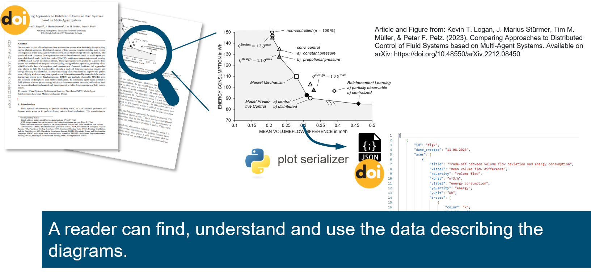

.. Plot Serializer master file, created by
   sphinx-quickstart on Fri Aug 11 11:31:38 2023.
   You can adapt this file completely to your liking, but it should at least
   contain the root `toctree` directive.

Welcome to Plot Serializer's documentation!
===========================================
Plot Serializer is a tool for converting your scientific diagrams into (FAIR) data.
It increases the transparency of scientific publications by helping you share data from your diagrams 
- with the option of providing custom metadata that can be as fancy as you want them to be.
It's simple and hassle-free!

.. toctree::
   :maxdepth: 1
   :hidden:

   user_guide
   api

.. include:: acknowledgement.rst